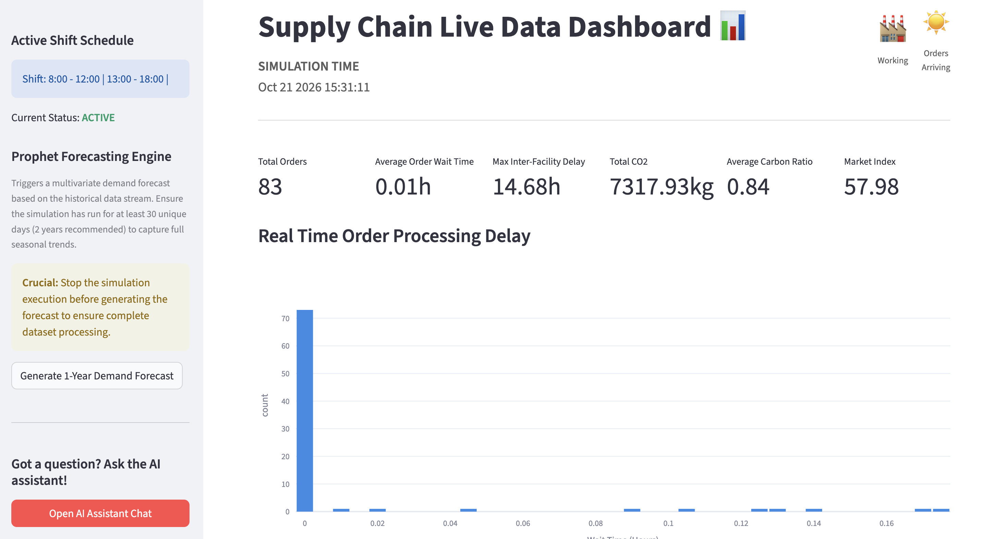
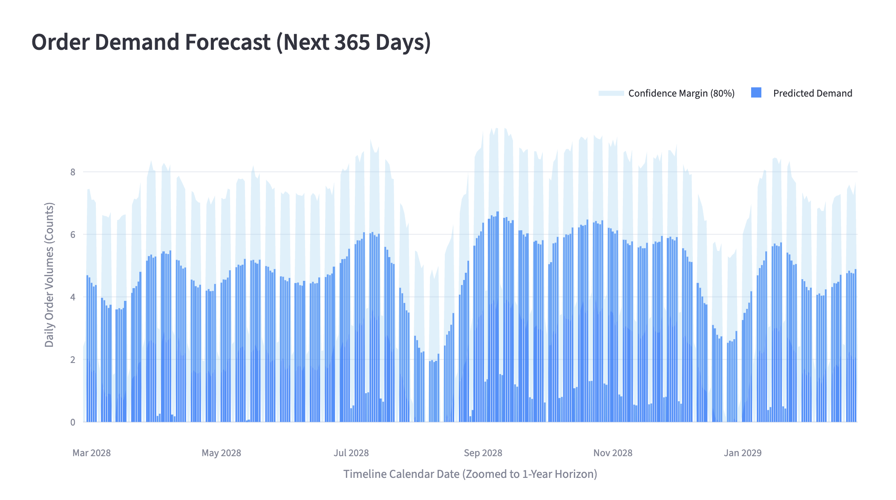
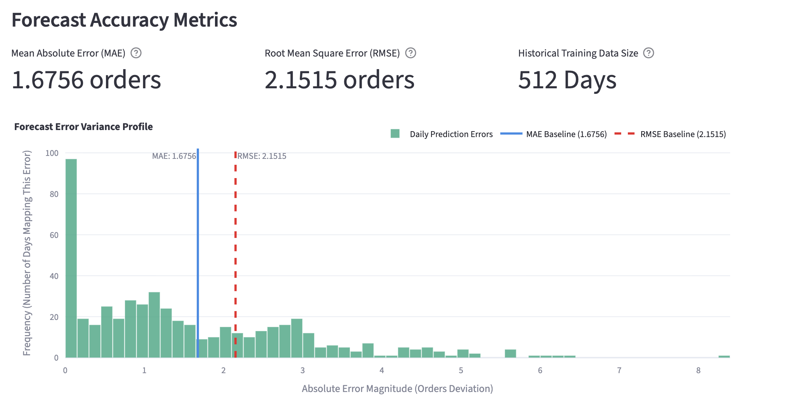
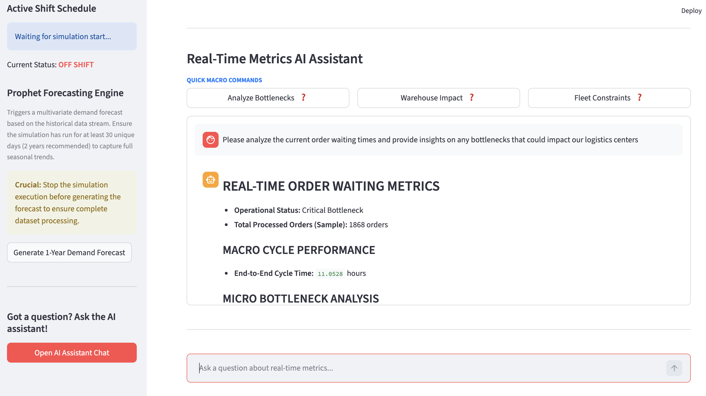

# Multi-Agent Digital Twin
This repository contains an end-to-end Digital Twin (DT) framework for simulating, forecasting, and optimizing supply chain operations. The framework integrates an AnyLogic simulation model with AI-driven predictive and prescriptive analytics, all accessible through a unified web interface providing descriptive, predictive, and prescriptive functionalities.

## Dashboard
### Descriptive Module

<p align="center">
  <br>
</p>

### Predictive Module

<p align="center">
  
  
</p>

### Prescriptive Module

<p align="center">
  <br>
</p>

---

## Repository Architecture

The repository is organized as follows:

*   **`actual_system.alp`** & **`3d/`**: The core AnyLogic simulation model representing the operational layer of the digital twin.
*   **`Libraries/`**: Project dependencies, including the configuration files required to bridge AnyLogic with Python (`pypeline.properties`).
*   **`prescriptive/`**: Modules dedicated to prescriptive analytics, optimization scripts, and decision-support logic.
*   **`forecast_engine.py`**: Time-series forecasting engine based on Prophet, used to estimate future customer order volumes.
*   **`brain.py`**: Asynchronous communication layer responsible for collecting real-time simulation data and streaming them to the web dashboard.
*   **`app.py`**: Streamlit-based web application providing the user interface for the descriptive, predictive, and prescriptive modules.
*   **`config.json`**: Configurable parameters for simulation setup.

---

## Requirements
Before running the project, ensure that the following software is installed:

- **AnyLogic** 8.9.8 or later
- **Python** 3.10 or later

## Installation

### 1. Clone the repository

```bash
git clone https://github.com/chiarastrozzii/dt-supply-chain.git
cd dt-supply-chain
```

### 2. Create a Python virtual environment

It is recommended to use a dedicated virtual environment.

**Windows**

```bash
python -m venv .venv
.venv\Scripts\activate
```

**Linux/macOS**
```bash
python3 -m venv .venv
source .venv/bin/activate
```

### 3. Install the required Python packages
Install all project dependencies using:

```bash
pip install -r requirements.txt
```

---
## Workflow

The overall workflow is summarized below:

1. Run the AnyLogic simulation.
2. Monitor the system through the descriptive dashboard.
3. Generate demand forecasts.
4. Use the AI assistant to analyze forecasts and obtain optimization recommendations.
---

## AnyLogic Configuration

Before running the simulation, complete the following configuration steps.

### 1. Open the AnyLogic Model

Open the AnyLogic project.

### 2. Configure the Pypeline Connection

The project uses the **PyCommunicator** block to establish communication between AnyLogic and Python.

1. Start the simulation.
2. While the simulation is running, select the **PyCommunicator** block in the **Main** agent.
3. In the inspection panel, verify that:
   - the connection has been successfully established;
   - the correct Python interpreter is being used (preferably the one from the project's virtual environment);
   - no error messages are displayed.

If the connection cannot be established, ensure that:
- Python is installed and available in your system `PATH`;
- the virtual environment is activated;
- all dependencies have been installed using:

```bash
pip install -r requirements.txt
```

### 3. Configure the Project

Open `config.json` and adjust the project settings according to your environment, including:

- input and output directories
- simulation parameters

---
## Running the Digital Twin

The application is designed to be used in three sequential phases: **descriptive**, **predictive**, and **prescriptive**.

### 1. Launch the Web Application

Within the activated virtual environment, start the Streamlit dashboard:

```bash
streamlit run app.py
```

---

### 2. Run the Simulation (Descriptive Module)

Open the AnyLogic model and start the simulation.

While the simulation is running, the **Descriptive** module of the dashboard provides real-time monitoring of the simulated supply chain, including:

- key performance indicators (KPIs);
- interactive graphical visualizations.

To obtain meaningful forecasting results, it is recommended to simulate **at least two years** of operation. However, a minimum simulation horizon of **30 simulated days** is required to generate an initial forecast.

Once the desired simulation horizon has been reached, stop the simulation before generating the demand forecast.

---

### 3. Generate the Demand Forecast (Predictive Module)

The forecasting model can be executed in one of two ways:

- by clicking **Generate 1-Year Demand Forecast** from the left navigation bar on the dashboard
- manually from the activated virtual environment

```bash
python forecast_engine.py
```

> **Note**
> Running `forecast_engine.py` generates the forecast data required by the prescriptive module. Therefore, this step must be completed before using the optimization assistant.

After the forecast has been generated, the **Predictive** module on the dashboard displays:

- daily demand forecast for the following simulated year
- prediction confidence intervals;
- forecasting performance metrics, including:
  - Root Mean Square Error (RMSE);
  - Mean Absolute Error (MAE).

---

### 4. Use the Prescriptive Module

Select the **Prescriptive** module from the left navigation panel.

The dashboard provides an AI-powered assistant that can answer questions about the supply chain and recommend operational decisions based on the available data.

You can either:

- select one of the predefined prompts
- type your own question into the chat interface

The assistant uses information from:

- the descriptive module;
- the demand forecast generated by the predictive module;
- optimization routines;
- specialized analysis tools.

> **Important**
> The forecasting engine must have been executed successfully before using the prescriptive module, as it relies on the forecast CSV files generated by `forecast_engine.py`.
